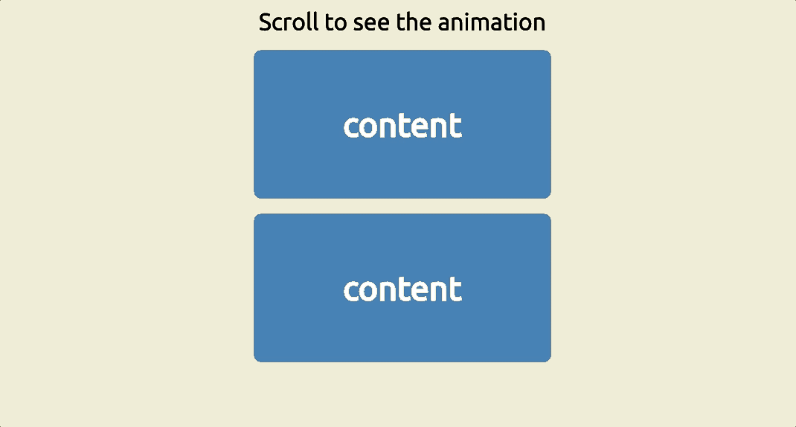

# 🎬 Scroll‑Intro

A sleek and smooth **scroll-based intro** built with **HTML**, **CSS**, and **JavaScript**.  
Adds an immersive full-screen introduction that disappears elegantly as the user scrolls. 🚀

---

## 🎥 Demo

<p align="center">
  
</p>

---

## ✨ Features

-  Fullscreen intro section on page load  
-  Auto-dismisses on scroll, swipe, or gesture  
-  Smooth transition into the main content  
-  Lightweight and framework-free  

---

## 🛠️ Technologies Used

-  **HTML** – structure and layout  
-  **CSS** – styling and transitions  
-  **JavaScript** – scroll detection and DOM control  

---

## 📦 How to Use

1. 📥 Clone the repository:
   ```bash
   git clone https://github.com/JehanAB/Scroll-Intro.git
